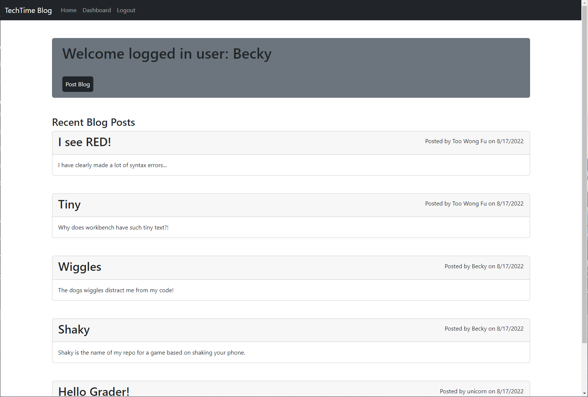

# Tech Blog

## Table of contents
​
- [Overview](#overview)
  - [The challenge](#the-challenge)
  - [User Story](#user-story)
  - [Acceptance Criteria](#acceptance-criteria)
  - [Screenshot](#screenshot)
  - [Links](#links)
- [My process](#my-process)
  - [Built with](#built-with)
  - [What I learned](#what-i-learned)
  - [Continued development](#continued-development)
  - [Useful resources](#useful-resources)
- [Author](#author)
- [Acknowledgments](#acknowledgments)
​
​
## Overview
​
### The challenge
​
The Tech Blog web application is NodeJS blog style website that utilizes NPM packages to provide a full blog experience.  User's can create an account, login, and CRUD blogs as well as comments.  When visiting the site, the homepage displays all blog post from newest to oldest; the user can interact with each post by clicking on one.  Then user's can read and add comments.  In addition, if the client is logged in and wants to edit/delete a comment or blog, they can do so with ease.  To provide security and user sessions, express-sessions was utilized with an expiring cookie so that users will be logged out after one hour.
​
### User Story
​
```md
AS A developer who writes about tech
I WANT a CMS-style blog site
SO THAT I can publish articles, blog posts, and my thoughts and opinions
```
​
### Acceptance Criteria

```md
GIVEN a CMS-style blog site
WHEN I visit the site for the first time
THEN I am presented with the homepage, which includes existing blog posts if any have been posted; navigation links for the homepage and the dashboard; and the option to log in
WHEN I click on the homepage option
THEN I am taken to the homepage
WHEN I click on any other links in the navigation
THEN I am prompted to either sign up or sign in
WHEN I choose to sign up
THEN I am prompted to create a username and password
WHEN I click on the sign-up button
THEN my user credentials are saved and I am logged into the site
WHEN I revisit the site at a later time and choose to sign in
THEN I am prompted to enter my username and password
WHEN I am signed in to the site
THEN I see navigation links for the homepage, the dashboard, and the option to log out
WHEN I click on the homepage option in the navigation
THEN I am taken to the homepage and presented with existing blog posts that include the post title and the date created
WHEN I click on an existing blog post
THEN I am presented with the post title, contents, post creator’s username, and date created for that post and have the option to leave a comment
WHEN I enter a comment and click on the submit button while signed in
THEN the comment is saved and the post is updated to display the comment, the comment creator’s username, and the date created
WHEN I click on the dashboard option in the navigation
THEN I am taken to the dashboard and presented with any blog posts I have already created and the option to add a new blog post
WHEN I click on the button to add a new blog post
THEN I am prompted to enter both a title and contents for my blog post
WHEN I click on the button to create a new blog post
THEN the title and contents of my post are saved and I am taken back to an updated dashboard with my new blog post
WHEN I click on one of my existing posts in the dashboard
THEN I am able to delete or update my post and taken back to an updated dashboard
WHEN I click on the logout option in the navigation
THEN I am signed out of the site
WHEN I am idle on the site for more than a set time
THEN I am able to view comments but I am prompted to log in again before I can add, update, or delete comments
```

### Screenshot

<br>


​
### Links

- Live Website: [https://nolans-tech-blog.herokuapp.com/](https://nolans-tech-blog.herokuapp.com/)
<br>

## My process
​
### Built with
​
- JavaScript
- NodeJS
- NPM express-handlebars
- NPM express
- NPM sequelize
- NPM mysql2
- NPM bcryptjs
- NPM express-sessions
- NPM connect-session-sequelize
​
### What I learned
​
In this challenge, I leanred about the challenges when truly devloping a fullstack application.  One challenge that occurred was how to conditionally display a edit button on comments that belonged to the logged in user.  This required me to handle creating a boolean for all comments fetch from the database in my backend routes code.  Below is a code snippet of how I handled creating this boolean:

```js
if (req.session.isLoggedIn) {
    // create boolean if user is viewing their post
    req.session.user.id === blogPost.userId ? blogPost.edit = true : blogPost.edit = false;
    // create a boolean in each comment for editing comments permission
    blogPost.comments.forEach(comment => {
        if (comment.userId === req.session.user.id) return comment.commentEdit = true;
        else return comment.commentEdit = false;
    });
};
```

Here, the `blogPost` is a data structure received from the database utilizing a sequelize query.  The blog post query included `comments` which were the associated comments for that post.  In my code, I first checked that the user was logged in currently.  Then, if they were, I used a `forEach()` array method on the comments to add a `commentEdit` boolean to the data structure for each element in comments; if true, it meant that the comment belonged to the logged in user.  Now, I could send this data when rendering the handlebars page and use it as a conditional.  Below is where I used it in the markup language:

```handlebars
{{#if data.commentEdit}}
<div class="card-footer">
    <button data-commentid="{{data.id}}" type="button" class="editComment-btn btn btn-danger" data-bs-target="#editComment-modal"
        data-bs-toggle="modal">Edit</button>
</div>
{{/if}}
```
​
As seen above, now I could conditionally add an edit button on the dynamically displayed comments only for the comments that belong to the logged in user.

### Continued development
​
In the future, I want to utilize this project as a template to implement a blog feature in other applications that I build.  While this is a fairly raw skeleton for a blog, it provides a great starting point to refine into a well developed blog.  Other features I would like to add include: edited labels for edited comments, more personalized dashboard, improved styling and UI/UX, and private messaging.
​
### Useful resources
​
- [Sequelize DOCS associations](https://sequelize.org/docs/v6/core-concepts/assocs/) - The seqeulize docs were great at breaking down how to use their association methods.

- [Handlebars Docs](https://handlebarsjs.com/) - While handlebars is simple to use, I found referencing their docs was very helpful and gave insight to cool features I would've overlooked.

​
## Author
​
Nolan Spence
- Website - [Nolan Spence](https://unicorn-barf.github.io/Portfolio_Website_HTML_CSS/)
- Github - [https://github.com/Unicorn-Barf](https://github.com/Unicorn-Barf)
​
## Acknowledgments

Thank you to Luigi TA for my bootcamp discussing standard practices when passing data to handlebars markup with backend rendering.